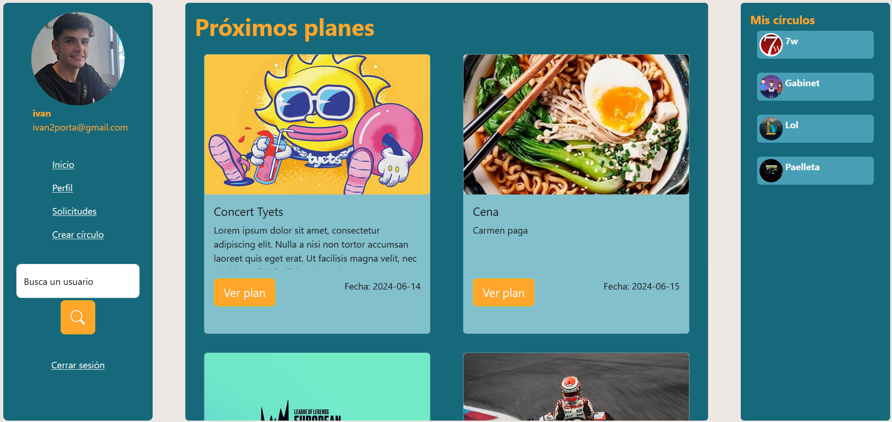
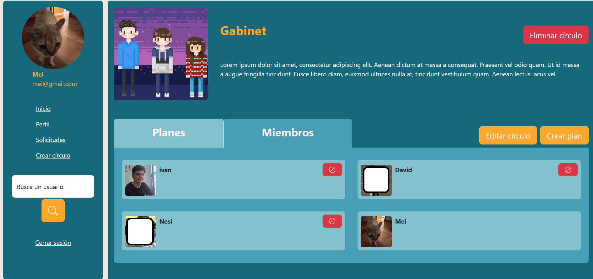
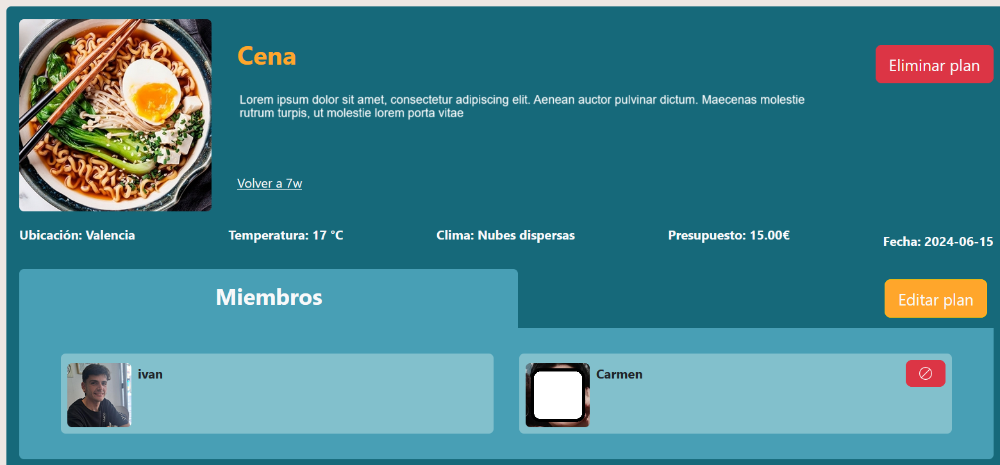

# 🌐 Proyecto: Coordinación de Planes en Círculos

Bienvenido al repositorio de **Coordinación de Planes en Círculos**, una plataforma web diseñada para facilitar la organización de planes con amigos. A través de esta página, los usuarios pueden registrarse, crear grupos privados (círculos) e invitar a otros a unirse para planificar y coordinar actividades de manera eficiente.

## 🚀 Funcionalidades Principales

- **Registro de usuarios**: Permite a cualquier usuario crear su cuenta y acceder a la plataforma.
- **Círculos privados**: Los usuarios pueden crear grupos cerrados, llamados *círculos*, donde solo los miembros invitados pueden participar.
- **Organización de planes**: Dentro de cada círculo, los miembros pueden proponer planes con detalles como:
  - Fecha del evento.
  - Presupuesto estimado.
  - Ubicación.
  - Descripción del plan.
- **Confirmación de asistencia**: Los miembros del círculo tienen hasta una fecha límite para confirmar si van a participar en el plan.
- **Visibilidad de planes y asistentes**: Todos los miembros pueden ver qué planes están propuestos, para cuándo, y quiénes han confirmado su participación, facilitando la coordinación entre amigos.

## 🎯 Objetivo

El objetivo de esta aplicación es permitir a los usuarios organizar sus planes de manera sencilla y eficiente. Ya no será necesario manejar múltiples conversaciones para saber quién asistirá a un evento; con esta plataforma, toda la información sobre los planes de tus amigos estará centralizada en un solo lugar.

## 📑 Estructura del Proyecto

1. **Autenticación y manejo de usuarios**: Sistema de registro, inicio de sesión y gestión de perfiles de usuario.
2. **Gestión de círculos**: Creación, administración y unión a círculos privados de usuarios.
3. **Planes**: Los miembros de un círculo pueden:
   - Proponer un plan.
   - Confirmar su participación antes de la fecha límite.
   - Ver los detalles del plan y quién ha confirmado asistencia.
4. **Notificaciones**: Alertas para avisar a los usuarios de planes nuevos y fechas límite para confirmar asistencia.

## 📸 Ejemplo de Uso

1. Un usuario crea un círculo llamado "Vacaciones 2024".
2. Invita a sus amigos a unirse al círculo.
3. Proponen un plan para hacer una excursión, fijando fecha, lugar y presupuesto.
4. Los miembros del círculo confirman si participarán en la excursión antes de la fecha límite.
5. Todos pueden ver de forma clara quién asistirá y los detalles de la actividad.

---

## 🖼️ Ejemplos visuales de la plataforma

### Pantalla de Inicio

### Pantalla de Círculo

### Propuesta de un Plan

